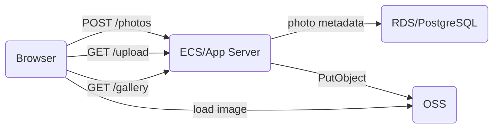

## Aliyun Web App Demo Operation Handbook
### About this Demo
This is a simple demo of showing how easily developers can integrate web application with Aliyun OSS. In this demo, user will be able to upload photos to OSS through webpage, and see all the photos that uploaded on OSS in browser.

### System Overview
Running this demo involves setting up three different Aliyun services: `ECS`, `RDS` and `OSS`. See the diagram below. (In case mermaid doesn't render, checkout diagram [here](https://github.com/shuoliu/ali-demo/tree/master/src/main/resources/static/system-overview.png))


First of all, an ECS instance is required to run the web application. It serves two webpages for upload and display photos respectively. It also accepts post requests from client to store photo onto OSS by using `putObject` method.

Second, an OSS bucket needs to be created in order to store user uploaded photos. It will also expose a public address which browser can directly use as the image source.

Last but not least, an RDS instance is needed to store photo metadata, including photo id and the image url that points to OSS bucket.

### Deployment Instruction
Following below steps to set up the demo. For simplicity, all services will be created under the same account and same region. Create VPC or enable public access if needed for cross account/region access.

#### ECS
 1. On Aliyun console, select *Elastic Compute Service* from *Products* list. On the opened panel click *Instances*.
 2. Click *Create Instance* on the up right corner to start the guided instance creation flow.
 3. A few important options:
	- Image: select CentOS.
	- Network: select VPC, create a new one if necessary.
	- Network Billing Method: check *Assign public IP*. If skip this step, you can set up *Elastic IP* later.
	- Security Group: configure or create new security group with port 80 and 22 open.
	- Log on Credentials: create a key pair (recommended) or set up password.
 4. After creation, find the assigned public address in ECS instances console, make sure you can ssh to it.

#### RDS
 1. On Aliyun console, select *RDS* from *Products* list. On the *Instances* panel click *Create Instance* to start the guided instance creation flow.
 2. A few important options:
	 - DB Engine: select PostgreSQL.
	 - Network Type: select the same VPC as the one for ECS instance.
 3. Upon creation, navigate back to the *Instances* panel, select the newly created instance.
 4. Click *Accounts* on the left panel, create a database account.
 5. Click *Security* on the left panel, open the default group, remove 127.0.0.1, and select the ECS intranet IP which belongs to the ECS instance that created earlier.
 6. Click *Connection Options* on the left panel, click *Modify Connection Address*, on the pop-up window, change the port to `5432`.
 7. Note down the intranet address for later set up.

#### OSS
 1. On Aliyun console, select *RDS* from *Products* list. Click `+` on the left panel to create a bucket.
 2. In the *ACL* section, select *Public Read*.
 3. Note down `Endpoint` for both Internet access and intranet access.

#### RAM
To programmatically read/write to OSS, we need to create a user with correct policy, and create an access key for our application, to access OSS on behalf of us.
 1. On Aliyun console, select *Resource Access Management*. In *Users* panel, click *Create User*.
 2. On the *User Details* panel, click *Create Access Key*. Remember to save the access key information on the pop-up window, before close it. Keep the access key in safe place.
 3. On the *User Authorization Policies* panel, edit Authorization Policy and add `AliyunOSSFullAccess`.

#### Set up Environment on ECS instance
***Install Software***
Log onto the ECS instance using assigned public IP, run the following commands to install JDK8 and psql client:
 - `yum install java-1.8.0-openjdk`
 - `yum install postgresql`

***Create DB Table***
Use psql to connect to database using the following command:
    - `psql -h <RDS intranet address> -d postgres -U <RDS username>`
Run the following SQL query to create photo metadata table:
```
create table photos (
    id varchar primary key,
    uploaded_time timestamp,
    name text,
    oss_path varchar
);
```
***Upload Application JAR***
The demo application is developed and built using Spring Boot, and can be run as a jar program without container. Obtain the application jar (demo.jar), upload to ECS instance using `scp`:
    - `scp <jar location>/demo.jar root@<ECS public IP>:~/`

#### Start Demo Application
In bash command line set JVM options: `JAVA_OPTS="-D<key1>=<value1> -D<key2>=..."`
These options are required for the demo to run:
> -Dspring.datasource.url=jdbc:postgresql://\<RDS intranet address>:5432/postgres
-Dspring.datasource.username=... #RDS username
-Dspring.datasource.password=... #RDS user password
-Daliyun.oss.endpoint.read=... #OSS public endpoint
-Daliyun.oss.endpoint.write=... #OSS intranet endpoint
-Daliyun.oss.bucket=... #OSS bucket name
-Daliyun.access.key.id=... #RAM access key ID
-Daliyun.access.key.secret=... #RAM access key secret

Start the app server in daemon:
`nohup java $JAVA_OPTS -jar demo.jar > server.log 2>&1 &`

### Verify Deployment
Open browser, navigate to the public IP address of ECS. It should redirect to `/upload` page. Select a photo with size less than 8 MB, click upload. If an alert pops up saying "success", click *See Uploaded* link. On the next page, the uploaded photo should show up. If any operation failed in the middle, go to ECS instance and check `server.log` to debug.
